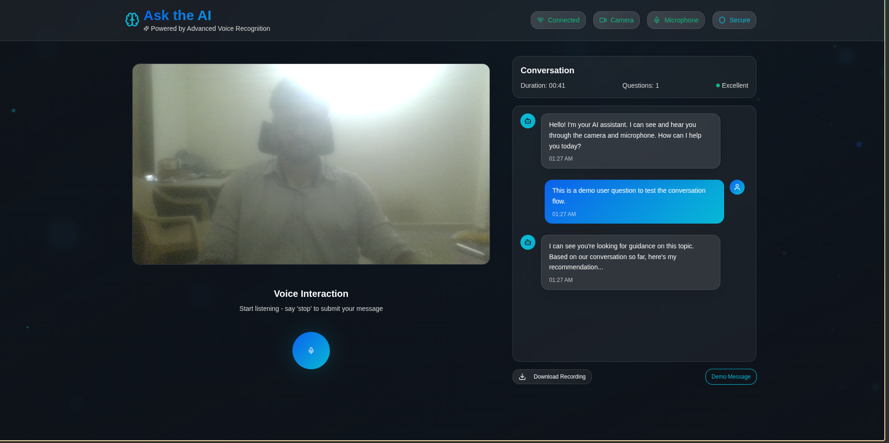

# Ask the AI - Voice Input AI Interaction App



A modern, responsive web application that enables users to interact with an AI assistant through voice input while simultaneously recording their entire session (audio + video). Built with React, TypeScript, and advanced browser APIs for a seamless voice interaction experience.

## 🎯 Features

### Core Functionality
- **Voice Input Recognition**: Real-time speech-to-text transcription using browser's SpeechRecognition API
- **Live Camera Feed**: Continuous webcam display throughout the session
- **Session Recording**: Automatic recording of both video and audio from session start to end
- **AI Response Simulation**: Mock AI responses with realistic 2+ second delays
- **Continuous Listening**: Smart voice interaction with "stop" command detection

### Advanced Features
- **Real-time Transcription**: Live display of spoken words as they're being processed
- **Smart Stop Commands**: Natural voice command detection to submit messages
- **Session Management**: Complete session control with recording download capability
- **Responsive Design**: Mobile-friendly interface with modern glass-morphism design
- **Browser Compatibility**: Comprehensive support detection and user guidance
- **Error Handling**: Robust permission and connectivity error management

## 🛠 Technical Stack

- **Frontend**: React 18 + TypeScript + Vite
- **UI Components**: Custom components with Radix UI primitives
- **Styling**: Tailwind CSS with custom animations and glass-morphism effects
- **State Management**: React hooks with custom hook abstractions
- **Media APIs**: 
  - `navigator.mediaDevices.getUserMedia()` for camera/microphone access
  - `MediaRecorder` API for session recording
  - `SpeechRecognition` / `webkitSpeechRecognition` for voice input
- **Build System**: Vite with SWC for fast compilation

## 📋 Prerequisites

- Node.js (v18 or higher)
- npm or yarn
- Modern web browser with media API support:
  - **Recommended**: Chrome, Safari, Edge
  - **Limited Support**: Firefox (no speech recognition)

## 🚀 Quick Start

1. **Clone the repository**
   ```bash
   git clone <repository-url>
   cd lucid-speak-interface
   ```

2. **Install dependencies**
   ```bash
   npm install
   ```

3. **Start development server**
   ```bash
   npm run dev
   ```

4. **Open in browser**
   Navigate to `http://localhost:5173`

5. **Grant permissions**
   - Allow camera access when prompted
   - Allow microphone access when prompted

## 🎮 Usage Guide

### Starting a Session
1. Click "Start Listening" to begin voice interaction
2. Camera feed will automatically activate
3. Session recording begins immediately
4. Speak naturally - your words appear in real-time

### Voice Interaction
- **Speak normally**: Your words are transcribed live
- **Say "stop"**: Submits your message and receives AI response
- **Continuous mode**: Automatically restarts listening after AI response

### Session Management
- **Live Status**: Visual indicators show recording/listening status
- **Download Recording**: Save your session as a .webm file
- **Session Duration**: Real-time session timer display

### AI Responses
- Realistic 2+ second response delays
- Context-aware mock responses
- Natural language processing simulation

## 📱 Browser Compatibility

| Browser | Voice Recognition | Camera/Recording | Overall Support |
|---------|:----------------:|:---------------:|:---------------:|
| Chrome  | ✅ | ✅ | ✅ Full Support |
| Safari  | ✅ | ✅ | ✅ Full Support |
| Edge    | ✅ | ✅ | ✅ Full Support |
| Firefox | ❌ | ✅ | ⚠️ Limited (No Voice) |

*Note: Voice recognition requires Chrome, Safari, or Edge. Firefox users will see a compatibility warning.*

## 🏗 Project Structure

```
src/
├── components/
│   ├── VoiceButton.tsx        # Voice recording control
│   ├── CameraView.tsx         # Live camera feed
│   ├── ConversationArea.tsx   # Chat interface
│   ├── StatusIndicator.tsx    # Connection status
│   └── ui/                    # Reusable UI components
├── hooks/
│   ├── useSpeechRecognition.ts # Speech API integration
│   ├── useMediaRecorder.ts     # Recording functionality
│   └── use-*.ts               # Additional custom hooks
├── pages/
│   └── Index.tsx              # Main application page
└── assets/
    └── ai-tech-background.jpg # Background imagery
```

## 🎨 Design Features

- **Glass-morphism UI**: Modern translucent design elements
- **Responsive Layout**: Optimized for desktop, tablet, and mobile
- **Animated Indicators**: Smooth status and loading animations
- **Professional Typography**: Clean, accessible font choices
- **Status Visualization**: Clear visual feedback for all states

## 🔧 Configuration

### Environment Variables
No environment variables required for basic functionality.

### Build Configuration
- **Development**: `npm run dev`
- **Production**: `npm run build`
- **Preview**: `npm run preview`
- **Lint**: `npm run lint`

### Recording Settings
Default recording configuration:
- **Format**: WebM with VP9/Opus codecs
- **Video**: 1280x720 resolution, 2.5 Mbps bitrate
- **Audio**: 128 kbps bitrate
- **Fallback**: Auto-detection of browser capabilities

## 🎥 Demo


*Complete demonstration featuring:*
- Voice input functionality
- Real-time transcription
- Camera feed operation
- Session recording and download
- AI response generation

## ⚡ Performance Notes

- **Optimized Rendering**: Efficient re-renders with proper dependency management
- **Memory Management**: Automatic cleanup of media streams and resources
- **Responsive Design**: Smooth performance across device sizes
- **Error Recovery**: Graceful handling of permission and API failures

## 🤝 Contributing

1. Fork the repository
2. Create a feature branch
3. Make your changes
4. Test thoroughly across supported browsers
5. Submit a pull request

## 📄 License

This project is part of a technical assignment for Sky Clad Ventures.

## 🏆 Assignment Completion

This project successfully implements all required features from the Full Stack Engineer Assignment:

✅ **Voice Input**: Browser-based speech recognition with live transcription  
✅ **AI Interaction**: Mock responses with mandatory 2+ second delays  
✅ **Camera Integration**: Continuous webcam feed during sessions  
✅ **Session Recording**: Complete audio/video recording with download  
✅ **Modern React**: Functional components with hooks and TypeScript  
✅ **Professional UI/UX**: Clean, responsive, intuitive design  
✅ **Error Handling**: Comprehensive permission and connectivity management  
✅ **Mobile Responsive**: Optimized for all device sizes  

---


